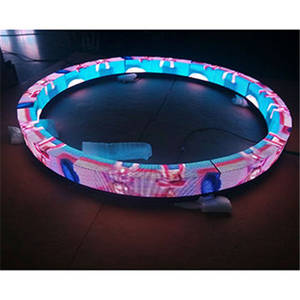

[Mockup image/inspiration image]

# CIRCLE OF INTENT - Augment Your Mindfulness
Physical Meditation Visual/Auditory Assist Accessory

Circular screen around the user assembled in 4 parts. Modular (audio module, laser module). Custom rotating text/code.
Two independent circles underneath the screen band with red lasers rotating in opposite directions outside the circle to create visual soothing effects. Lasers can also we setup upwards so they form a wall around the meditator. The whole thing can be setup vertically on a wall to create a wall installation.

## Modules

- Circular Screen Module (default, 4 parts)
- Audio Guidance Module
- Laser Visualization Module (Vertical/Horizontal)
- Attachment Module (for wall placement)

## Philosophy

4 directions for the circle (Intent, Self, Others, ?)

Audio pings rotating every 15 minutes. Total of an hour session.

5min "Focus on your intent"

5min "Focus on your body"

5min "Purge your mind from thoughts"

Chakra Mode - opening 7 rivers

## Initial Script
For a mental version of the Circle of Intent.

CIRCLE OF INTENT MODULE
“Initiating Circle of Intent Module.”

5 sec break

"Please draw 1/4th of a mental circle around you."
"This is your **space of self-intent**. Thoughts processes directed inwards will stabilize your existing inner energy and ground your approach to yourself. Think about how you intend to treat yourself."

3min break

"Please draw 2/4th of a mental circle around you."
"This is your **space of outward intent**. Thought processes directed outward will stabilize your perception of others and create the way forward. Think about how you intend to treat others."

3min break

"Please draw a 3/4th full mental circle around you."
"This is your **space of higher intent**. Thought processes directed into the void will summon positive energy within you. Think about how you intend to use that energy."

3min break

"Please draw a full mental circle around you."
"This is your **space of general intent**. Thought processes now need to be grounded on the observed reality and will gain initial direction and create a spark of willpower due to clarity. Think about your day's overall intent and focus."
